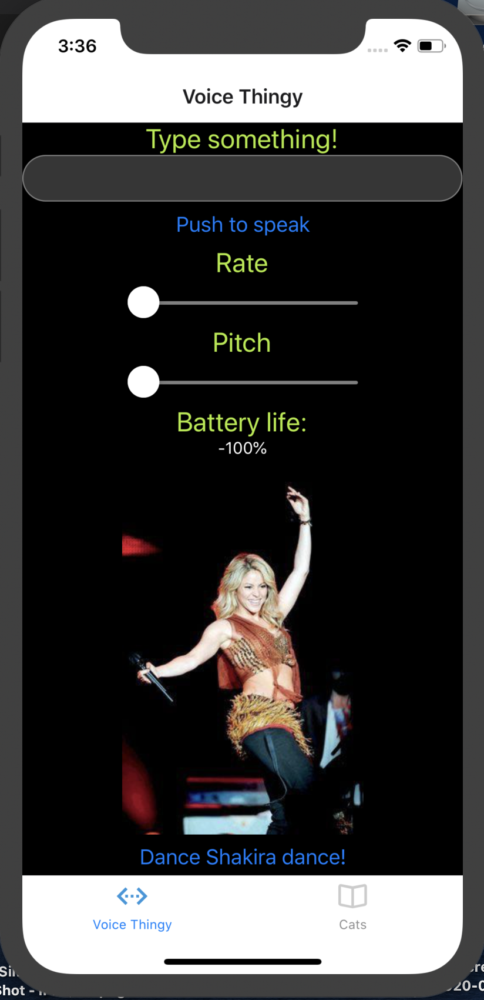
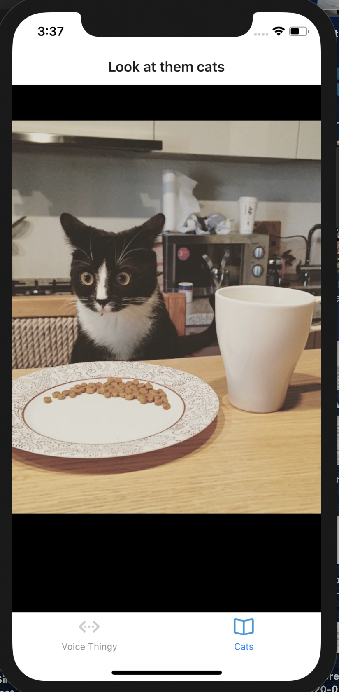

# Lab 41: The Everything App

## Authors: Natalie Alway and David Vloedman!

## How to use the app:
* Clone this repo
* `npm install`
* `npm start` or `expo start`
   * Once everything loads, a server will pop up and start running on `http://localhost:19002/`

* Scan the QR Code
   * iPhone: use the camera app to scan the code and it will prompt you to open via Expo app
   * Android: use the expo app to scan the code

   ## In the app:
   ### Main Page:
   Text to Speech:
   * Type something into the text box, and press the `Push to Speak` button to convert the text to speech. 
   * Adjust the `Rate` to increase or decrease the rate of the speech
  * Adjust the `Pitch` scale to adjust the pitch of the voice.

  Shakira:
  * Click the `dance Shakira dance!` button to flip the image of Shakira to make it look like shes dancing.

  ### Cats Page:
  * Swipe left or right to see a variety of images of cats!

  ## Dependencies
 * expo
 * react
 * react-native
 * react-native-gesture-handler
 * expo-constants
 * expo-speech
 * expo-battery
 * expo-assets
 * expo-image-manipulator
 * react-native-image-slider-box

 
 

